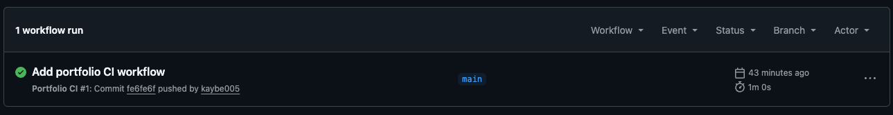
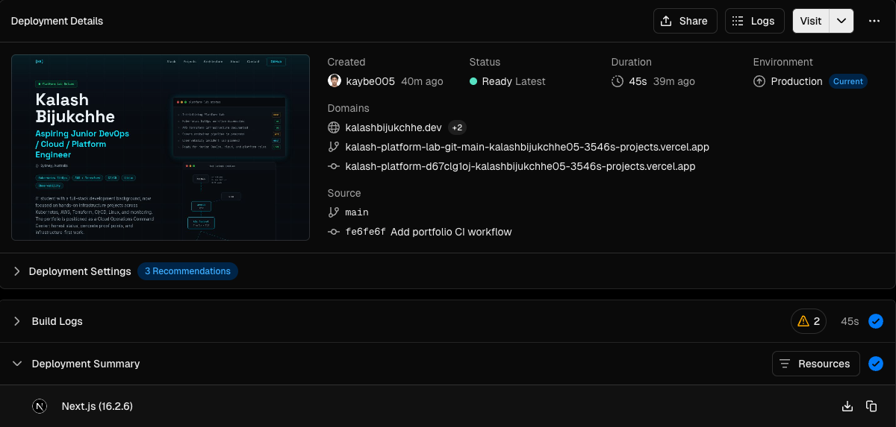
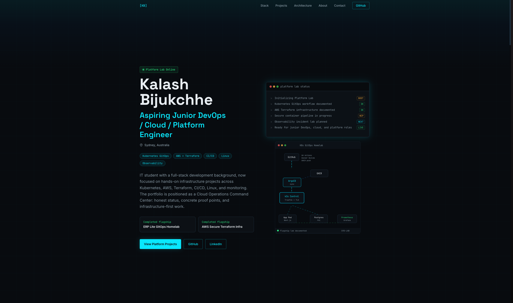

# Kalash Platform Lab — DevOps Portfolio

Kalash Platform Lab is the personal portfolio for Kalash Bijukchhe, an aspiring Junior DevOps / Cloud / Platform Engineer based in Sydney, Australia.

The site focuses on hands-on infrastructure work across Kubernetes, AWS, Terraform, CI/CD, Linux, and observability. It highlights a transition from full-stack development into DevOps, cloud infrastructure, and platform engineering.

This repository is also a real CI/CD deployment project for a public-facing portfolio. Code changes are checked with GitHub Actions, built as a Next.js application, deployed through Vercel, and served through a custom `.dev` domain managed with Name.com DNS.

## Live Site

Live site: https://kalashbijukchhe.dev

## Project Purpose

The delivery workflow for this portfolio is:

```text
Code change
-> GitHub push / pull request
-> GitHub Actions CI
-> TypeScript check
-> Lint
-> Production build
-> Vercel deployment
-> Custom .dev domain
```

## Tech Stack

| Area | Tooling |
| --- | --- |
| Framework | Next.js App Router, React |
| Language | TypeScript |
| Styling | Tailwind CSS |
| CI | GitHub Actions |
| Deployment | Vercel |
| Domain | Name.com `.dev` |
| Quality checks | TypeScript, ESLint, production build |

Package-confirmed versions include Next.js `16.2.6` and React `19.2.4`.

## Local Development

```bash
npm install
npm run dev
```

Local URL:

```text
http://localhost:3000
```

## Verification

```bash
npm run typecheck
npm run lint
npm run build
```

These checks are also run in GitHub Actions before changes are accepted into the main deployment path.

## CI/CD Workflow

Workflow file: `.github/workflows/ci.yaml`

The workflow runs on push and pull request events targeting `main`.

It performs:

- Repository checkout
- Node.js 20 setup with npm caching
- Dependency installation with `npm ci`
- TypeScript check
- ESLint
- Production build

Security scanning and Lighthouse CI are not currently implemented.

## Deployment

The portfolio is deployed through Vercel and connected to the GitHub repository.

- Production deployment: Vercel
- Custom domain: `kalashbijukchhe.dev`
- DNS provider: Name.com
- Environment variables: none required for the current portfolio build

## Screenshots







## Featured Portfolio Projects

- [ERP Lite GitOps Homelab Platform](https://github.com/kaybe005/erp-lite) - completed flagship project covering Kubernetes, k3s, Helm, ArgoCD, GitHub Actions, GHCR, Docker, Traefik, cert-manager, PostgreSQL PVC, and Prometheus/Grafana.
- [AWS Secure Web Infrastructure with Terraform](https://github.com/kaybe005/aws-terraform-web-infra) - completed flagship project covering Terraform, AWS VPC, public/private subnets, ALB, NAT Gateway, private EC2, IAM, SSM Session Manager, and security groups.
- [DevOps Portfolio CI/CD Pipeline](https://github.com/kaybe005/kalash-platform-lab) - completed project covering Next.js, TypeScript, GitHub Actions CI, Vercel deployment, Name.com DNS, and the live custom `.dev` domain.
- Kubernetes Observability & Incident Response Lab - planned.

## Content Structure

- `data/projects.ts` - featured project content and status labels
- `data/skills.ts` - skill areas, roadmap, and certifications
- `components/` - portfolio sections and reusable UI components
- `app/layout.tsx` - site metadata, fonts, and root layout
- `app/page.tsx` - homepage section composition
- `app/globals.css` - Tailwind import, design values, and global styles

## What This Project Demonstrates

- Modern portfolio built with Next.js, TypeScript, and Tailwind
- DevOps/cloud-focused personal branding
- Automated CI checks with GitHub Actions
- Vercel deployment workflow
- Custom `.dev` domain setup
- Clear separation of completed and planned projects

## Future Improvements

- Lighthouse CI
- Dependency and security scanning
- Preview deployment documentation
- Branch protection
- Downloadable resume
- Project case study pages

## Resume Bullet

Built and deployed a DevOps-focused portfolio website using Next.js, TypeScript, GitHub Actions, Vercel, and a custom `.dev` domain to showcase Kubernetes, AWS, Terraform, CI/CD, and platform engineering projects.
